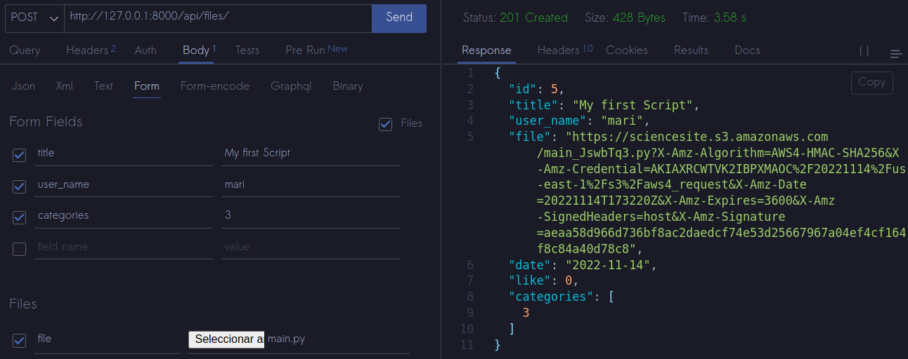
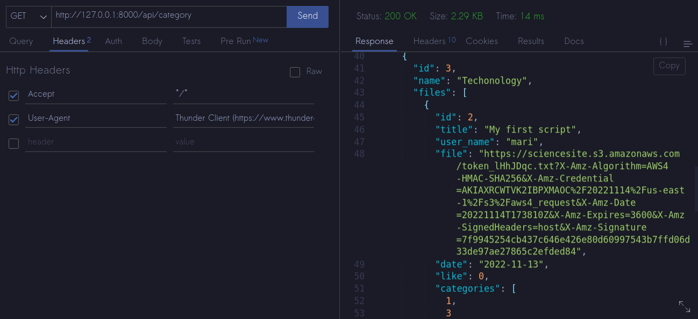
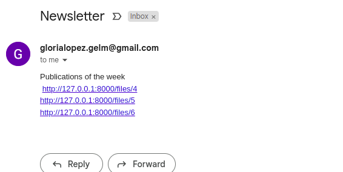

## CRUD API with Django Rest Framework

In this project I have created an API for site of science, in which, users can upload any kind of file related to science, like; scripts, images, etc, also the users can like those files and subscribe to the newsletter containing the publications of the week that is sent every Sunday.

* The files will be stored in a bucket in Amazon S3
* Emails sending is scheduled with cron

### Starting

Follow the steps below to have the project in local

Clone the repsitory 

```
git clone https://github.com/soyglorialopez/science_site_api.git
```

Create a virtual environment

```
python -m venv env
```

_Despending on the OS you use, you can activate the virtual environment, here is a [link](https://docs.python.org/3/library/venv.html) with the ways_

Install the dependecies

```
pip install -r requirements.txt
```

We need to add the cron job in our system

```
python manage.py crontab add
```

### Endpoints

| Endpoint                 | Method                   | Result                                                            |
| ------------------------ | ------------------------ | ----------------------------------------------------------------- |
| `api/files/`           | GET                      | List of files                                                     |
| `api/files/`           | POST                     | Create a new publication                                          |
| `api/files/pk`         | GET<br />PUT<br />DELETE | Retrieve a file<br />Update a file<br />Delete a file          |
| `api/category`         | GET                      | List of Categories                                                |
| `api/category/pk`      | GET<br />PUT<br />DELETE | Retrieve a category<br />Update a category<br />Delete a category |
| `api/suscription`      | POST                     | Add email to suscription                                         |
| `api/files/pk/like`    | POST                     | Like a file                                                       |
| `api/files/pk/dislike` | POST                     | Dislike a file                                                    |

### Test the API

For test the API, it can use the Http client [Postman](https://www.postman.com/)  or in your vscode the extension named [Thunder](https://www.thunderclient.com/)

Create a new publication



List of Categories



The API supports also pagination and filter

```
http://127.0.0.1:8000/api/files?user_name=mari
http://127.0.0.1:8000/api/files?like=100
http://127.0.0.1:8000/api/files?date=2022-11-13
http://127.0.0.1:8000/api/category?name=Technology

```

```
http://127.0.0.1:8000/api/files?page=3
http://127.0.0.1:8000/api/category?page=2
```

Example of Newsletter


